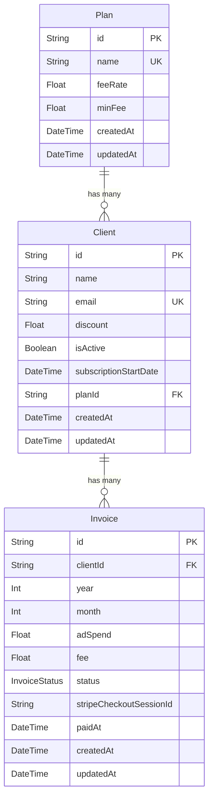

# Billing System (Grow My Ads)

Billing app for an ad agency: monthly fee from ad spend + plan (rate + minimum) + optional client discount. Invoices with draft → sent → paid; dashboard with active clients, monthly total, and average invoice.

## Stack

- **Next.js 16** (App Router), **TypeScript**
- **PostgreSQL** + **Prisma**
- **Tailwind**, **shadcn/ui**, **React Hook Form** + **Zod**

## What’s in it

- **Plans:** Basic (8% / $200 min), Pro (12% / $500), Premium (16% / $1000). Seeded via `db:seed`.
- **Fee:** `max(adSpend × rate, minFee)` then discount %; logic in `src/lib/billing.ts`.
- **Clients:** CRUD, plan + discount; active/inactive (inactive = no new invoices in practice).
- **Invoices:** Generate from ad spend; status transitions enforced in API (draft editable, sent/paid locked).
- **Dashboard:** Active client count, current month total invoiced, average invoice.
- **Bonus:** Proration for mid-month subscription start (`billing.ts`); Stripe Checkout + webhook for payment; possibility to remove plan for User pausing.

## Database structure



- **Plan** — three tiers; `feeRate` as decimal (e.g. 0.08), `minFee` in dollars. One plan has many clients.
- **Client** — optional `planId`; `discount` is percentage (e.g. 10 for 10%). `subscriptionStartDate` used for proration on first invoice.
- **Invoice** — unique per client + month + year. Status: DRAFT → SENT → PAID. Stripe session and `paidAt` for payments.

## Fee calculation

Order of operations (per assignment: minimum first, then discount):

1. **Raw fee:** `calculated = adSpend × feeRate`
2. **Minimum:** `afterMinimum = max(calculated, minFee)` — so we never charge below the plan minimum.
3. **Proration:** if the client’s first month and they started mid-month, multiply `afterMinimum` by `prorationRatio` (days remaining / days in month).
4. **Discount:** `afterDiscount = afterMinimum × (1 - discount/100)` — discount applies to the amount after the minimum (and proration), always in full.
5. **Round** to 2 decimal places.

Example: Basic (8%, $200 min), ad spend $1,000, 50% discount → $80 calculated → $200 minimum → $200 × 0.5 = **$100**.

---

**Walkthrough video:** https://www.loom.com/share/bc0910e48df94991af1d7f373b0a5b8a

## Run locally

```bash
npm install
cp .env.example .env   # set DATABASE_URL
npm run db:migrate
npm run db:seed
npm run dev
```

**Deployed:** https://billing-system-gamma-steel.vercel.app/
